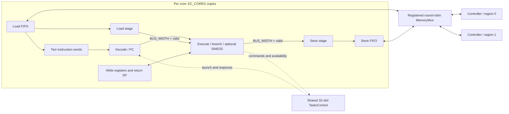

# CPU architecture

Extreme CPU is a cacheless, bandwidth-oriented multicore processor described
in synthesizable C++HDL. Cores execute general scalar programs, stream copies
through their own pipelines, and optionally perform full-register SIMD32
arithmetic. A shared hardware task controller dispatches dependent work without
an OS scheduler. There is no separate DMA engine.

This document describes the implemented prototype. See the
[instruction reference](instructions.md) for encodings and operand semantics,
[task engine](tasks_engine.md) for its sequencing contract, and
[compiler ABI](../compiler/README.md) for the freestanding C++ subset.

## System organization

[`rtl/System.h`](../rtl/System.h) connects identical `Core` instances, their
private load/store FIFOs, one `MemoryMux`, independent `Memory` banks, and one
32-slot `TasksControl`. Each core exposes load/store request and response ports
for integration with external memory controllers. The task command/response
interface is separate from memory arbitration.



The BUS_WIDTH stage payloads and valid bits form the streaming COPY path.
Ordinary instructions use a serial control sequence around the same core
resources. No caches, register scoreboards, address dependency comparisons,
or forwarding paths are present. FIFO completion metadata tracks transport
progress; task predecessor masks track work dependencies. Neither introduces
CPU data-hazard detection.

All RTL blocks use C++HDL `_assign`, `_work`, and `_strobe` semantics:
combinational connections read current state, `_work` computes next state, and
`_strobe` commits it. The same C++ testbenches drive native C++HDL simulation
and generated SystemVerilog through Verilator.

## Configuration and feature selection

Compile all RTL and testbench translation units with the same settings.
Defaults and validity checks are in [`rtl/Config.h`](../rtl/Config.h).

| Setting | Default | Meaning | Root CMake parameter |
|---|---:|---|---|
| EC_BITS | 128 | BUS_WIDTH in bits: 64, 128, 256, or 512 | Yes |
| EC_DEPTH | 16 | Entries in each FIFO; power of two, 2–256 | Yes |
| EC_CORES | 2 | Identical cores, 1–16 | Yes |
| EC_BANKS | 2 | Independent memory regions/controllers | Yes |
| EC_SIMD | OFF | Include SIMD32 in every core | Yes |
| EC_REGS | 8 | Full-width registers per core, 3–16 | Compile-time macro only |
| EC_BANK_WORDS | 4096 | Bus words per memory region | Compile-time macro only |

For example:

```sh
cmake -S . -B build/simd -DCMAKE_BUILD_TYPE=Release \
    -DEC_BITS=128 -DEC_DEPTH=16 -DEC_CORES=2 -DEC_BANKS=2 -DEC_SIMD=ON
cmake --build build/simd -j2
ctest --test-dir build/simd --output-on-failure
```

`EC_SIMD=ON` defines the `EC_SIMD` preprocessor macro for the RTL, assembler,
compiler backend, and testbenches. The configured C++ compiler driver also
defines it for kernels. OFF leaves the macro undefined: the extension uses
`#ifdef EC_SIMD`, so manually defining `EC_SIMD=0` still includes it. All cores
share the same setting; there is no runtime feature switch. Standalone RTL
regression and synthesis scripts enable the extension with `--simd` and use
separate output directories ending in `-simd`.

`EC_REGS` and `EC_BANK_WORDS` must be supplied consistently as compiler macros
when overriding their defaults; they are not currently root CMake cache
parameters. Compiler image dimensions must match the hardware. The compiler
ABI requires at least eight registers even though the RTL permits smaller
register files. Dedicated task/compiler fixtures may use their own core and
bank counts; the parallel memcpy fixture uses three cores and four banks.

## Architectural state and instruction fetch

Each core has EC_REGS writable registers of BUS_WIDTH bits, a 32-bit byte PC,
a return-lane SP and limit, one compact-loop anchor, a current task ID, and
pipeline/control state. Scalar arithmetic reads bits 31:0 and replaces its
destination with a zero-extended 32-bit result. MOV, LD, and ST transfer a
whole register. SIMD32 replaces all lanes. Addresses use low 32-bit values;
there is no dedicated zero register or condition-code register.

Let `word_bytes = BUS_WIDTH/8`. Instructions use little-endian byte order.
`pc % word_bytes` is the `read_pos` byte pointer; `pc / word_bytes` identifies
the instruction word. Two tagged word registers, selected by word-address
parity, hold current and prefetched words. These are instruction stream buffers,
not a general instruction cache.

After the read position reaches half a word, the core requests the next word
through its load FIFO when no instruction fetch is already pending. Missing
current words have priority over data requests. A fetch already in flight may
finish after a branch; its address tag prevents executing it at the wrong PC.
Only one instruction fetch is pending per core. Data reads can still occupy
many FIFO entries during COPY. Fetch and data responses share the load FIFO
and carry a one-bit kind sideband; retirement preserves request order.

Instructions occupy 1–6 bytes and cannot straddle bus words. The assembler
pads unused tail bytes with one-byte NOPs. Speculative next-word fetches require
the instruction stream and its next word to be readable. A completed barrier
invalidates both instruction words after outstanding fetches drain; software
modifying its own code must execute a barrier before branching to that code.
Direct branch/call targets are absolute word indices, while indirect targets
and task entry addresses are aligned byte addresses.

## Execution and pipeline progress

The core has three logical multicycle stages: load, execute/branch, and store.
Memory latency and FIFO backpressure can extend an operation for as many clocks
as needed. Ordinary instructions execute serially; they do not all traverse
three simultaneously occupied payload registers.

| Operation | Execution behavior |
|---|---|
| Scalar ALU, MOV, branch, call/return | Decode, execute against current registers, then resume fetch/decode |
| LD/LDS | Enqueue one data read, wait for its FIFO result, then write the register |
| ST/STS | Capture the value and byte mask; wait for store FIFO acceptance, then resume |
| SIMD32 | Decode, compute every lane in execute, replace one entire register, then resume |
| COPY | Stream successive words through independent load/execute/store payload registers |
| BARRIER/HALT | Wait for local load/store queues and pending fetch to drain |
| Task command | Capture operands, optionally drain memory, submit a request, then await response |

For COPY, each payload register is BUS_WIDTH bits and has its own valid bit.
An occupied stage advances when its successor has room; a downstream stall
propagates back through this path to load-result consumption. Execute passes
each copied word unchanged. The core issues reads ahead through the load FIFO
and enqueues completed words through the store FIFO. This path implements the
copy itself; neither MemoryMux nor TasksControl copies payload data.

COPY reads the low 32-bit values of r0/r1/r2 as source, destination, and word
count. A zero count leaves every register unchanged. Otherwise, once all writes
are enqueued, r0/r1 become the advanced zero-extended addresses and r2 becomes
zero. Other registers are preserved. COPY does not wait for the final store
acknowledgement before resuming ordinary instruction execution.

## Optional SIMD32 execution

With `EC_SIMD` defined, every core has BUS_WIDTH/32 parallel 32-bit integer lanes
in its existing execute stage. Lane i is bits `32*i+31:32*i`, starting at the
least significant end. The opcode definitions, decode, intermediate values,
execution logic, and compiler intrinsics are guarded by `#ifdef EC_SIMD`.
Disabled cores fault on SIMD encodings; existing scalar encodings are unchanged.

The twelve operations are add, subtract, multiply, AND, OR, XOR, logical left
and right shifts, arithmetic right shift, unsigned and signed less-than, and
scalar broadcast. Add/subtract/multiply wrap within each lane; no carry crosses
lane boundaries. Shifts use the low five bits of the corresponding right-hand
lane. Comparisons produce 0 or 1. Broadcast replicates the source's low 32 bits
into all lanes. Sources are read before the destination is written, permitting
source/destination aliasing. There are no masks, saturation, reductions,
floating-point operations, or alternate lane widths in this extension.

SIMD instructions access registers only. Software uses existing full-width
loads and stores for vector data. They follow the ordinary serial instruction
schedule, so a load/SIMD/store loop does not inherit COPY's one-word-per-clock
throughput. The extension adds no pipeline stages or memory queues. Its
combinational multiply and shift units can affect area and timing when enabled;
physical timing has not been characterized.

[C++ SIMD intrinsics](../compiler/simd/README.md) lower aligned full-word memory
operands to loads, a SIMD instruction, and a store. The compiler drains prior
stores before input reads and drains the result store before continuing. LLVM
automatic vectorization remains disabled. SIMD results can overwrite occupied
return-address lanes if assembly software selects a register used by SP; the
compiler's intrinsic lowering preserves its reserved return and task registers.

## FIFOs and controller protocol

Each core owns one LoadFifo and one StoreFifo. Each has EC_DEPTH BUS_WIDTH
payload slots with separate address, kind, and completion metadata; store slots
also retain a byte-enable mask. A slot remains reserved from core acceptance
through retirement. Separate allocate, issue, and retire pointers permit many
controller requests in flight. A full FIFO deasserts ready and cannot accept a
replacement until a slot has actually retired.

The core enqueues when `push_in && ready_out`. A FIFO request remains asserted
with stable address, payload, mask, and slot tag until `accepted_in`. Every
accepted controller request, including a store, must produce exactly one
response containing the original tag, data, and error status. A FIFO can absorb
one response per clock into its reserved slot without response backpressure.
Errors remain sticky until reset.

Loads retire in request order even if independent banks return responses out
of order; the core consumes a completed head slot through `pop_in`. Stores
retain their slots until acknowledgement and automatically retire acknowledged
head entries. These completion bits do not compare addresses, forward data,
or infer that any later read is safe.

MemoryMux independently round-robins across all `2*EC_CORES` clients for each
bank. Client `2*c` is core c's load FIFO; client `2*c+1` is its store FIFO.
Each bank has a registered elastic request stage. The priority pointer advances
when the mux accepts a request into that stage. Tag bits 7:0 identify the FIFO
slot; higher bits identify the client. Independent banks can accept requests
in the same cycle; a stalled bank does not block the others. An additional
registered lane returns errors for unmapped addresses.

Each FIFO also has a registered answer stage in the mux and a round-robin
arbiter choosing among responses addressed to it. Different FIFOs can receive
answers together, including the load and store FIFOs of one core. Multiple
banks responding to the same FIFO are serialized with backpressure to those
banks. Controllers must hold their answer until the mux asserts
`mem_response_ready_out`. These request/answer registers separate controller
paths from FIFO state updates. Fairness assumes controllers eventually progress.

## Memory regions and bandwidth

Addresses are unsigned 32-bit byte addresses. Bank b owns the half-open region
`[b * EC_BANK_WORDS * word_bytes, (b+1) * EC_BANK_WORDS * word_bytes)`.
MemoryMux converts global addresses to bank-local byte addresses. Regions are
contiguous and equally sized in this prototype. Different controller
implementations can serve those regions; arbitrary base/limit routing is not
currently programmable. Total configured memory must fit the 32-bit address
space.

Every controller transaction is one aligned BUS_WIDTH word. LD/ST require
word alignment. LDS/STS handle naturally aligned byte, halfword, or 32-bit
accesses by selecting bytes inside that word. Stores carry one byte-enable
bit per bus byte; unselected bytes are preserved. Unmapped addresses produce
mux errors, and the supplied memory controller rejects unaligned bus requests
or out-of-range local addresses.

[`Memory.h`](../rtl/Memory.h) is a synthesizable single-port RAM with one
registered response and elastic backpressure. It can accept one read or write
per clock when enabled and its response path has room. Stores update RAM on
acceptance; their response certifies visibility. The enable input models
controller stalls. External controllers may have longer latency but must
preserve store visibility before acknowledging, echo tags, and honor the same
mask, error, and alignment contract.

For a buffer of B bytes, an ideal copy needs `B / word_bytes` payload clocks,
plus startup and drain overhead. Sustaining that rate requires one read and
one write per clock. Independent source and destination banks provide those
two transactions; one single-port bank needs at least two transactions per
copied word. Sufficient FIFO depth is also needed to hide response latency.

Two simultaneous copies at that same per-copy rate require two reads and two
writes per clock. `tests/memcpy2.cpp` therefore uses four independent single-port
banks and three cores: CPU0 issues work and two workers copy disjoint regions.
The regression checks that increasing both buffers by 1,024 words costs exactly
1,024 additional clocks. SIMD does not alter this memory-bandwidth requirement.
These are modeled throughput checks, not physical clock-frequency guarantees.

## Ordering and software responsibilities

Load and store queues are independent. A load to an address with a pending
store can observe old memory; no store buffer is searched or forwarded. Use
BARRIER between a write and a dependent read unless software has another valid
completion guarantee. Barriers cover only the issuing core. HALT also drains
local queues before reporting a normal boot-core stop.

Task dependencies provide a publication mechanism across cores: TISSUE drains
input writes before publishing a descriptor, and TFINISH/TABORT drain output
writes before publishing their result. A successor can then observe completed
predecessor writes. Independent writers still require an ownership protocol;
there are no atomic memory instructions or mutual-exclusion primitives.

COPY requires aligned, nonoverlapping ranges. Arbitrary byte counts and
misaligned copies need scalar prefix/tail handling; overlapping ranges need a
separate software algorithm. Pointer arithmetic wraps modulo 2^32, so software
must keep ranges within mapped memory. Completion of instruction enqueueing
is not completion of its stores, including for COPY and explicit SIMD loops.

## Register return stack and compiler ABI

There is no hardware memory stack. SP counts occupied 32-bit return-address
lanes in the architectural register file. Slot i selects register
`i / (BUS_WIDTH/32)` and lane `i % (BUS_WIDTH/32)`. CALL/CALLR write one lane,
increment SP, and branch. RET reads the last occupied lane and decrements SP.
Return PCs are rounded up to a bus-word boundary, so the assembler/compiler
must pad the continuation. No general register save/restore is implicit.

STACKLIMIT bounds the available return lanes and can change only with SP zero.
Reset permits `EC_REGS * (BUS_WIDTH/32)` slots. Software must preserve occupied
lanes and any caller values it needs. Underflow, overflow, and misaligned return
or indirect-call addresses fault the core.

The freestanding compiler reserves r0/r1 for return lanes, checks direct call
depth, and stores live values in static memory locations. Modules issuing tasks
have 33 private context frames: one per task slot plus one for boot code. They
reserve r7 as the frame base, allowing task instances to call shared helpers
without sharing spills or call mailboxes. Globals remain shared. The compiler
supports exception-free C++ kernels and explicit task/SIMD intrinsics; recursion,
RTTI, exceptions, arbitrary LLVM vector types, and a hosted runtime are outside
the implemented subset. See the [compiler ABI](../compiler/README.md).

## Dependent task dispatch

The shared controller holds 32 descriptors. Each has a 32-bit aligned entry
address, a 32-bit predecessor mask, a 32-bit result, and lifecycle metadata.
Waiting tasks become eligible when every masked predecessor is COMPLETE. A
rotating priority search selects a ready task and registers a reservation;
the next stage searches for a free core and registers its launch. A reservation
remains locked while all cores are busy. A core consumes the launch on the
following edge; there is at most one new reservation every two clocks.

A reusable core must have halted without a fault and drained its memory queues
and pending fetch. Launch clears registers, return SP, compact-loop state,
instruction buffers, and core/FIFO control state, then starts at the task entry.
Shared memory survives. Ownership and registered launch state prevent double
dispatch while a core is transitioning out of halt.

Task commands are separately arbitrated round-robin. Issuing and disarming
cannot modify reserved/running tasks. Active dependents protect predecessor
results from reuse. TREAD returns a result and readiness status without waiting
for completion. TFINISH publishes normal completion; TABORT publishes an error
and cancels dependent work. An error-valued TFINISH still releases eligible
successors. HALT or a fault inside an owned task is abnormal failure; RET only
returns from an ordinary function.

Task IDs are reusable slot indices, not generation handles. Software must
coordinate reuse and submit acyclic dependency graphs. Hardware does not detect
cycles or recover when all cores spin waiting for work that needs a free core.
Use successor tasks for joins and continuations. See
[tasks_engine.md](tasks_engine.md) for exact states, statuses, cancellation,
command races, and ownership rules.

## Integration, reset, and verification

System includes a host programming/readback port and read-only debug signals.
Host mode bypasses normal memory arbitration and disables task dispatch; it
does not pause an already running core. Use it only before cores start or after
every core has halted, memory operations have drained, and no task can launch.
`tasks_idle_out` alone is insufficient: a running boot producer could still
issue work. RAM contents are not cleared by reset; initialize readable locations
before running software.

System reset covers cores, FIFOs, the mux, task metadata, and controllers,
cancelling outstanding transactions. External controllers must also discard
old responses across reset. Invalid instructions, register indices, malformed
loops/calls, and memory errors fault the core. Accepted memory operations may
still finish after a fault. Faults require reset and are not precise restartable
exceptions. There are no interrupts, privilege modes, virtual memory, caches,
or production compiler/runtime in this prototype.

Regression coverage includes FIFO wraparound/reordering, mux arbitration and
stalls, scalar operations, calls, copies and bandwidth, task graphs, and SIMD
lane arithmetic/aliasing. SIMD-disabled tests check illegal-opcode faults;
enabled tests exercise all supported bus widths in native C++ and Verilator.
Compiled tests include exception-free libraries, SIMD intrinsics, task helpers,
and parallel copies. The instruction reference and compiler tests validate the
same encodings used by RTL.

Use CTest for a configured build, `make matrix` for the scalar/transport matrix,
and `make matrix-simd` for SIMD at 64/128/256/512 bits. The CMake `synth` target
passes the SIMD selection to the synthesis script. Its smoke configuration is
64 bits, one core, two-entry FIFOs, one bank, and 32 RAM words; other CMake
hardware dimensions are not automatically forwarded to that target. Use
`scripts/synth.py` arguments to select other synthesis dimensions. Yosys/slang
synthesis and `check -assert` validate generated logic; placement, timing,
area targets, and power remain uncharacterized.
