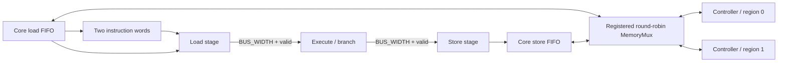

# Architecture, revision 0

## Organization

`rtl/System.h` assembles configurable identical cores, their private FIFOs,
`MemoryMux`, and independent `Memory` banks. `rtl/Core.h` can also be integrated
with external controllers through its exposed load/store request and response
ports. All blocks use C++HDL `_assign`, `_work`, and `_strobe` semantics.

The graph repeats per core upstream of the shared mux. No caches, forwarding,
scoreboards, or address conflict comparisons are present. Scalar instructions
execute serially across multicycle stages. This deliberate initial schedule
avoids overlapping scalar register writers; it does not detect hazards.
`COPY` sustains a full-width load/execute/store pipeline with independent valid
registers. A stage advances only when its successor can accept its output.
During copying, execute passes the loaded word unchanged; this is the insertion
point for future SIMD operations.

## Configuration

Compile all RTL and testbench translation units with the same settings.

| Macro | Default | Meaning |
|---|---:|---|
| EC_BITS | 128 | BUS_WIDTH; 64, 128, 256, or 512 |
| EC_DEPTH | 16 | Entries per load/store FIFO; power of two, 2–256 |
| EC_CORES | 2 | Identical cores, 1–16 |
| EC_REGS | 8 | Full-width architectural registers, 3–16 |
| EC_BANKS | 2 | Number of memory-controller regions |
| EC_BANK_WORDS | 4096 | Full-width words per memory region |

Addresses are unsigned 32-bit byte addresses. A bus word contains EC_BITS/8
bytes. Bank `b` owns the half-open region
`[b * EC_BANK_WORDS * bytes, (b+1) * EC_BANK_WORDS * bytes)`.
The mux subtracts the region base. Regions are contiguous and equally sized in
this prototype; different controller implementations can serve each region.
A request outside all regions returns an error. Misaligned requests return an
error from the supplied memory controller. Stores carry one byte-enable bit per bus byte; scalar stores select their lanes.

## Instruction fetch

Instructions use little-endian byte order. `pc % bytes` is the `read_pos` byte
pointer; `pc / bytes` identifies the current instruction word. Two tagged word
registers, selected by word-address parity, hold current and prefetched words.
These are instruction stream buffers, not a general instruction cache.

After the read position reaches half a word, the core requests the next word
through its load FIFO, when no instruction fetch is already pending. Missing
current words have priority over data requests. A fetch already in flight may
finish after a branch; its address tag prevents executing it at the wrong PC.
Only one instruction fetch is pending per core. Data reads can still occupy
many FIFO entries during `COPY`. Fetch responses and data responses share the
FIFO and have a one-bit kind sideband; retirement preserves their request order.

Instructions cannot straddle word boundaries in revision 0. The assembler pads
unused tail bytes with one-byte NOPs. Speculative next-word fetches require the
instruction stream and its next word to be readable. A completed barrier
invalidates both instruction words after all outstanding fetches drain, so
self-modifying code must execute a barrier before branching to modified code.

## FIFOs and controller protocol

Both FIFO payload arrays contain EC_DEPTH BUS_WIDTH words, with separate
address, instruction/data-kind, and completion metadata. A slot remains reserved
from core acceptance through retirement. Separate allocate, issue, and retire
pointers allow many controller requests in flight. A full FIFO deasserts ready;
it does not accept a replacement until a slot has actually retired.

Requests use valid/ready acceptance. The FIFO holds address, payload, and slot
tag stable until accepted. Controller responses contain data, error, and the
original tag. Every accepted request, including a store, must produce exactly
one response. An error is sticky until reset. Loads retire in issue order even
if different banks return responses out of order. Stores retain their slots
until acknowledgement and automatically retire acknowledged head entries.
Responses write their reserved slots, so the FIFO always has response capacity.
These completion bits manage transport ordering; they do not compare memory
addresses or detect data dependencies.

`MemoryMux` independently round-robins across all 2*EC_CORES load/store
clients for each destination bank. Each bank has its own registered elastic
request stage, and its priority pointer advances only when accepting a request.
Tag bits 7:0 identify the FIFO slot; higher bits identify the client. Independent
banks can accept requests in the same cycle; a stalled bank does not block the
others. An additional registered lane handles unmapped-address errors.

Each FIFO has a registered answer stage and a round-robin arbiter selecting
among bank responses addressed to it. Loads and stores can complete together;
two banks responding to the same FIFO are serialized with response backpressure.
Controllers hold their answer until `mem_response_ready` is asserted. Fairness
assumes controllers eventually progress. Reset covers cores, mux, and
controllers together, cancelling all outstanding transactions.

A streaming copy between independent source and destination banks can perform
one read and one write per clock, approaching one copied word per clock after
pipeline startup. Copying within one single-port bank still requires two bank
transactions per word. Adequate FIFO depth is necessary to hide response latency.

`Memory.h` is a synthesizable RAM with one registered response and elastic
backpressure. Stores update RAM on request acceptance; their response certifies
visibility. The enable input models controller stalls. External controllers may
have longer latency, but must preserve store visibility before sending their
acknowledgement, echo tags, and implement the same error/alignment contract.

## Ordering and software

Load and store queues are independent. A load to an address with a pending store
can observe the old memory value. No store buffer is searched or forwarded.
Use `BARRIER` between a write and a dependent read unless software has another
valid completion guarantee. `HALT` drains the local queues before reporting
completion. Barriers cover only the issuing core; multicore synchronization
needs a software protocol with single-writer ownership or a later atomic ISA.
The initial design has no coherence protocol and no atomics.

`COPY` issues all source reads and enqueues all destination writes, then resumes
instruction execution. It does not itself wait for the store FIFO to drain.
Use a barrier before dependent operations. It copies aligned, nonoverlapping
ranges in full-word units. Arbitrary byte counts and misaligned copies require
scalar byte/halfword/word operations; overlapping ranges require
a separate software algorithm. Pointer arithmetic wraps modulo 2^32, so software
must ensure its range does not wrap or leave mapped memory.

## Integration and limitations

`System` includes a host programming/readback interface for the testbench.
Host mode is allowed only while cores are reset/not started, or after every
core halts and queues drain. It is not concurrent bus arbitration. RAM contents
are not reset; initialize every word that software will read. The debug register
port is read-only observability, not a second architectural access path.

Invalid opcodes, register indices, malformed loop use, or memory errors assert
fault. Faults require system reset; they are not precise restartable exceptions.
A transaction accepted before a fault can still complete. This revision has no
interrupts, traps, privilege modes, virtual memory, or production compiler. A freestanding compiler prototype is in `compiler/`.

## Register return stack

A small SP indexes 32-bit lanes in the architectural register file. CALL/RET
store only aligned return addresses there; no memory stack is used. STACKLIMIT
allows software to reserve just the initial registers for returns. The compiler
checks call depth, reserves r0/r1, and uses static memory spill slots for caller
values. See the instruction reference and compiler README for precise semantics.

## Dependent task dispatch

`System` also connects each core to a shared 32-slot `TasksControl`. It selects
ready descriptors using predecessor-mask comparisons, then assigns a free core
through a registered launch. Tasks can issue more tasks and publish results;
reserved/running descriptors and referenced results are protected from mutation.
This scheduling metadata does not add CPU data-hazard detection or forwarding.
See [tasks_engine.md](tasks_engine.md) for the lifecycle and software contract.
